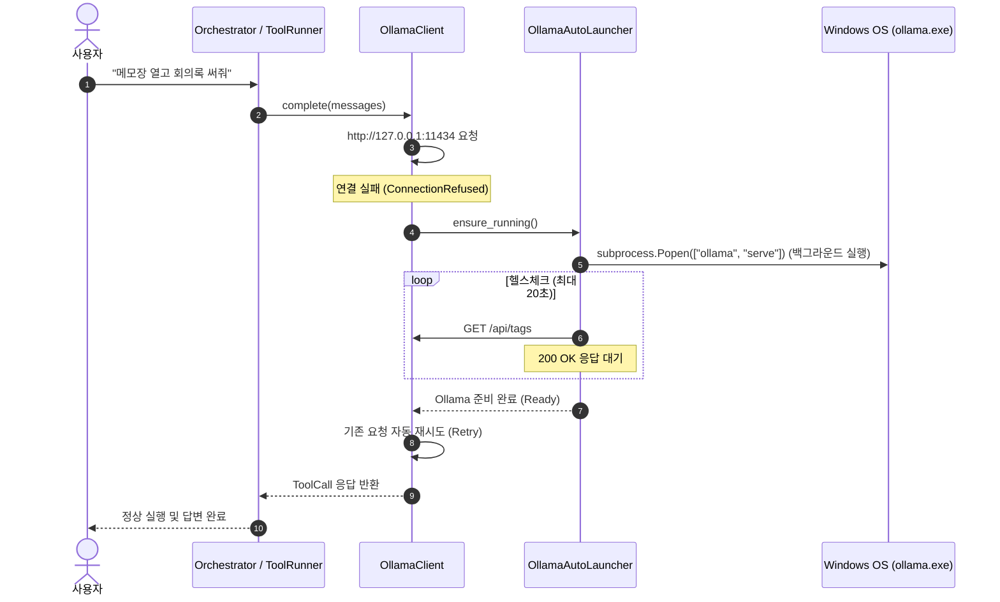

# 기능 제안서: Ollama 서버 자동 실행 및 자가 치유 (Auto-Launch & Self-Healing)

> **문서 상태**: 제안됨 (Proposed / Post-v1 또는 런타임 안정화 확장)  
> **관련 모듈**: [`app/llm/ollama_client.py`](../../app/llm/ollama_client.py) · [`app/orchestrator/loop.py`](../../app/orchestrator/loop.py)  
> **목적**: Ollama 서비스 미실행 상태에서 질의/도구 호출 인입 시, 자동으로 Ollama를 부트스트랩하여 무중단 응답 보장

---

## 1. 개요 및 배경

현재 자비스는 사용자가 사전에 `ollama serve`를 켜두지 않았거나 재부팅 등으로 Ollama가 종료된 상태에서 대화를 시도하면 `LLMUnavailable` 예외를 발생시키며 즉시 실패합니다.

이 제안서는 자비스가 **Ollama 연결 실패(`ConnectionRefusedError`)를 감지했을 때, 백그라운드에서 `ollama serve`를 자동으로 기동(Auto-Launch)하고 헬스체크를 통과한 후 원래의 요청을 자동으로 재시도(Self-Healing)**하는 메커니즘을 정의합니다.

---

## 2. 해결하려는 문제 & 사용자 가치

* **해결하려는 문제**: 사용자가 수동으로 터미널을 열고 `ollama serve`를 켜야 하는 번거로움과, Ollama가 꺼져 있을 때 도구 호출(`ToolCall`)이나 대화가 완전히 중단되는 불편함 해소.
* **사용자 가치**: PC를 켜고 자비스를 실행하기만 하면 로컬 AI 두뇌(Ollama)가 필요할 때 알아서 켜져 100% 핸즈프리 동작 가능.

---

## 3. 핵심 아키텍처 및 동작 시퀀스



---

## 4. 상세 설계

### 4.1 설정 정의 (`config/settings.yaml`)

```yaml
llm:
  auto_launch:
    enabled: true                   # Ollama 미실행 시 자동 실행 여부
    binary_path: "ollama"           # 실행 파일 경로 (PATH에 있으면 "ollama")
    startup_timeout_s: 30           # 부팅 대기 최대 시간(초)
    poll_interval_s: 1.0            # 헬스체크 폴링 주기
```

### 4.2 오토 런처 구현체 (`app/llm/launcher.py`)

```python
"""Ollama process launcher and healthcheck manager."""
from __future__ import annotations

import subprocess
import time
from urllib.error import URLError
from urllib.request import Request, urlopen

from app.core.errors import LLMUnavailable


class OllamaLauncher:
    def __init__(
        self,
        base_url: str = "http://127.0.0.1:11434",
        binary_path: str = "ollama",
        startup_timeout_s: float = 30.0,
    ) -> None:
        self._base_url = base_url
        self._binary = binary_path
        self._timeout = startup_timeout_s

    def is_healthy(self) -> bool:
        req = Request(f"{self._base_url}/api/tags", headers={"Accept": "application/json"})
        try:
            with urlopen(req, timeout=1.5) as resp:
                return resp.status == 200
        except Exception:
            return False

    def ensure_running(self) -> bool:
        if self.is_healthy():
            return True

        # 백그라운드 프로세스로 ollama serve 기동
        try:
            subprocess.Popen(
                [self._binary, "serve"],
                shell=False,
                stdout=subprocess.DEVNULL,
                stderr=subprocess.DEVNULL,
                stdin=subprocess.DEVNULL,
                creationflags=getattr(subprocess, "CREATE_NO_WINDOW", 0)
                | getattr(subprocess, "DETACHED_PROCESS", 0),
            )
        except OSError as error:
            raise LLMUnavailable(
                f"Ollama 실행 파일을 찾을 수 없습니다: {self._binary}. Ollama를 설치해주세요.",
                {"binary": self._binary, "error": str(error)},
            ) from error

        # 부팅 완료 헬스체크 폴링
        deadline = time.monotonic() + self._timeout
        while time.monotonic() < deadline:
            time.sleep(1.0)
            if self.is_healthy():
                return True

        raise LLMUnavailable(
            f"Ollama를 자동 실행했으나 {self._timeout}초 내에 응답하지 않았습니다.",
            {"timeout_s": self._timeout},
        )
```

### 4.3 `OllamaClient` 연동 (`app/llm/ollama_client.py`)

```python
# OllamaClient.complete() 내부
except OllamaConnectionFailure as error:
    if self._launcher and self._launcher.ensure_running():
        # Ollama가 성공적으로 켜졌으므로 즉시 재시도
        continue
    self._retry_or_raise("connection_error", attempt, ctx, error)
```

---

## 5. 보안 및 자원 관리 원칙

1. **`shell=False` 강제**: 임의 셸 명령 조립 없이 고정 실행 파일 이름 배열만 사용.
2. **단일 인스턴스 보호**: 이미 Ollama가 포트 11434를 점유 중이면 중복 프로세스를 띄우지 않고 기존 프로세스를 그대로 사용.
3. **타임아웃 강제**: 최대 30초 내에 포트가 열리지 않으면 무한 대기하지 않고 명확한 에러를 반환.

---

## 6. 구현 체크리스트

- [ ] **1. 설정 모델 확장**: `LLMSettings`에 `auto_launch` 필드 추가
- [ ] **2. 런처 모듈 작성**: `app/llm/launcher.py` 작성
- [ ] **3. 클라이언트 연동**: `OllamaClient`의 연결 실패 예외 핸들러에 `launcher.ensure_running()` 결합
- [ ] **4. 단위 테스트 작성**: `tests/unit/test_ollama_launcher.py` (프로세스 기동 Mock, 헬스체크 성공/타임아웃 테스트)
